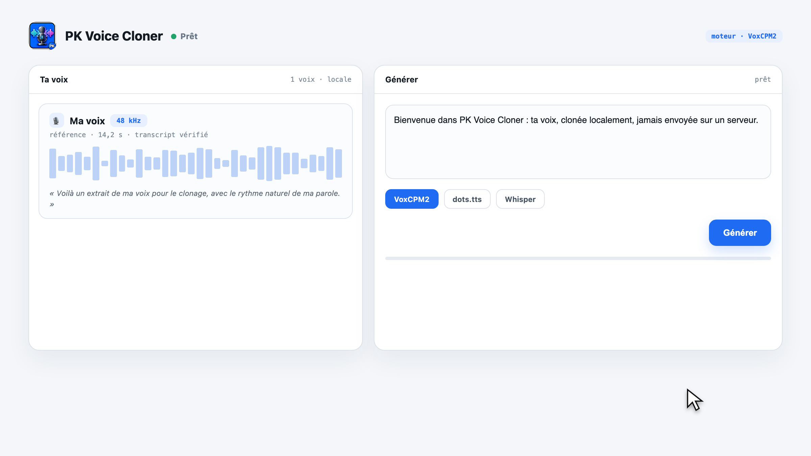
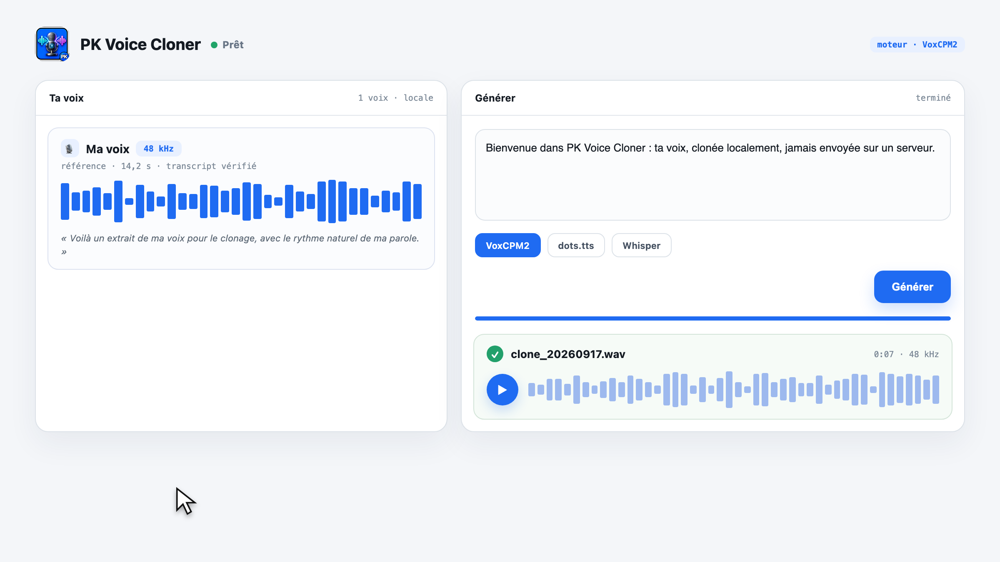

# PK Voice Studio

[🇫🇷 FR](README.md) · [🇬🇧 EN](README_en.md)

version **2026.10.42** · macOS Apple Silicon · Apache-2.0 · [Changelog](CHANGELOG.md)

🎙️ **Studio vocal IA open source — 100 % local.** Ta voix dit n'importe quel texte. Basé sur [VoxCPM2](https://github.com/OpenBMB/VoxCPM), [dots.tts](https://github.com/studio-dots-ai/dots.tts) et [faster-whisper](https://github.com/SYSTRAN/faster-whisper), sur la puce Apple via MPS. **Aucune donnée ne quitte la machine.**

 

## 📥 Installation

Le canal actuellement vérifié est l’installateur depuis les sources (macOS Apple Silicon). Il prépare l’environnement Python et construit l’app :

```sh
curl -fsSL https://raw.githubusercontent.com/mondary/Macos_PKvoicecloner/main/install.sh | sh
```

La release GitHub v0.6.0 propose aussi un DMG, et le tap Homebrew possède un cask, mais ces deux paquets ne sont pas autonomes : l’app seule dépend du dépôt source et de son environnement Python. Leur installation directe ne constitue donc pas encore un parcours fonctionnel. Voir [la page store](store/website/index.html) et [CHANGELOG](CHANGELOG.md).

Le site publiable prêt pour FTP est autonome dans [`store/website/`](store/website/) : téléverse le contenu de ce dossier sur ton hébergement (le point d’entrée est `index.html`).

## ✅ Fonctionnalités

- **Moteurs commutables** — **VoxCPM2** (MPS, rapide, ~30 langues) et **dots.tts** (2B, clonage haute fidélité 48 kHz, 24 langues) : un clic dans l'en-tête du studio
- **Modèles à tester** — bouton **Installer** / **Supprimer** pour chaque modèle optionnel (Qwen3-TTS 0,6B, Pocket TTS) : les poids rejoignent le cache local et tout modèle installé devient sélectionnable comme moteur de génération
- **Clonage ultimate** — clip + transcript → timbre, rythme et style préservés
- **Bibliothèque de voix** — chaque clip importé ou enregistré devient un clone persistant, réutilisable d'une session à l'autre : liste, écoute, sélection, suppression
- **Upload ou micro** — QuickTime `.m4a`, `.mp3`, `.wav`, `.webm`, ou enregistrement direct dans la page (état vide guidé : importer ou s'enregistrer)
- **Transcription auto** — Whisper large-v3 (multilingue) par défaut, ou Parakeet Redux (~178 Mo) en option ; transcript éditable avant génération
- **Gestionnaire de modèles** — choisis dans l'interface les moteurs de synthèse, transcription et catégorisation ; installe puis active le modèle voulu sans passer par le terminal
- **Vitesse** 0,75×–1,5× — étirement temporel pur, le pitch reste intact
- **Modèle résident, à la demande** — chargé une fois pendant la session ; **Éteindre** libère sa mémoire dès que tu as fini
- **Offline** — modèles en cache local, aucun appel réseau
- **Versions toujours visibles** — versions de l'app et du serveur affichées dans la barre fixe du haut, à côté de l'état du studio ; un écart est signalé. Le studio web affiche sa version en pied de page
- **Feuille de route** — le plan « double numérique » (clonage rapide, avatar photo → vidéo lipsyncé) se lit dans [TODO.md](TODO.md)
- **`mavox`** — clone en une commande depuis le terminal, texte quoté ou non
- **App native macOS** — interface native SwiftUI, zéro navigateur : le serveur démarre et s'arrête avec l'app, mises à jour automatiques via Sparkle
- **Vue d’ensemble sans doublons** — stats des voix, modèles, livres et confidentialité ; état du serveur, activation rapide d’une voix, journal, installation de modèle, livres récents et dernières prises générées
- **Studio livre intégré à l'app native** — bouton « Ouvrir le studio web » : ouvre la bibliothèque EPUB et son éditeur dans une fenêtre de l'app macOS (WKWebView), pendant que le serveur local tourne
- **Réglages dans la fenêtre principale (⌘,)** — providers IA et clés API, token Hugging Face, Crédits & inspirations, Bibliothèque de projets, Soutenir/Ko-fi et À propos avec canaux Stable/Dev. L’icône waveform de la barre des menus rouvre le studio ; Dock et menu bar se règlent séparément dans Général.
- **Navigation alignée app / studio web** — mêmes entrées des deux côtés : Vue d'ensemble, Bibliothèque de voix, Texte vers voix, Livres, Modèles, Réglages ; l'app ouvre le studio des livres depuis sa section Livres
- **Livres audio (studio web)** — importe un EPUB, compare l'original au texte structuré phrase par phrase, avec attribution colorée des voix, génération des segments et écoute continue avec respirations selon la ponctuation ; l'éditeur audiobook n'est pas encore intégré à SwiftUI
- **Analyse et voix des livres** — enregistre plusieurs providers OpenAI-compatibles (GLM, DeepSeek, OpenAI ou Ollama local), associe chaque personnage à une voix de la bibliothèque et génère les segments individuellement ou en lot séquentiel ; la page livre affiche l'état des analyses, segments et audios
- **Contrôle d'attribution local (Laya)** — un petit modèle embarqué (322M, chargé une fois depuis le cache Hugging Face partagé) relit chaque chapitre et signale les segments « narrateur » qui ressemblent à du dialogue : zéro token, zéro cloud après le premier téléchargement
- **Export audiobook** — « Exporter le chapitre » produit un WAV unique avec les pauses de ponctuation intégrées ; « Exporter l'audiobook » assemble le livre en **M4B chapitré** (pochette, métadonnées), écoutable dans Apple Livres et la plupart des lecteurs
- **Studio épuré** — tableau de bord monochrome : bibliothèque de voix, éditeur et catalogue de modèles

### Interface native

- **Démarrer** lance le serveur local, y compris depuis Finder. L'état du modèle s'actualise automatiquement.
- **Démarrage automatique** : le serveur démarre à l'ouverture de l'app ; éteint, un panneau d'accueil explique et propose un gros bouton Démarrer.
- **Installation puis activation enchaînées** : un modèle installé depuis le studio s'active tout seul à la fin du téléchargement.
- **Bibliothèque de voix** : importer un audio, enregistrer au micro, sélectionner une voix, l’écouter ; menu **…** pour renommer ou supprimer.
- **Modèles** : installer un moteur du catalogue pris en charge, l’activer ; menu **…** pour renommer ou supprimer ses poids locaux. Les installations et erreurs sont visibles.
- **Texte vers voix** : éditer le transcript, régler la vitesse, générer, puis écouter ou exporter le WAV.
- **Ouvrir le studio web** : le bouton en haut de la fenêtre ouvre `http://127.0.0.1:8809` dans le navigateur ; le serveur doit être démarré. La bibliothèque de livres et l'éditeur EPUB sont actuellement disponibles dans cette interface web.
- Les erreurs apparaissent dans la page avec un accès au journal du serveur.

## 🧠 Utilisation

1. Ouvre **PK Voice Cloner.app** depuis le dossier macOS **Applications** (chemin : `/Applications/PK Voice Cloner.app`)
2. À gauche : **Importer** un clip ou **Enregistrer** ta voix → la transcription part toute seule et le clone rejoint la bibliothèque
3. Sélectionne une voix, écris ton texte à droite, règle la vitesse si besoin, **Générer**
4. Écoute, télécharge, recommence — les clones restent disponibles au prochain lancement
5. Quand la session est terminée, clique **Éteindre** en haut à droite : le serveur Python et VoxCPM sont arrêtés et leur mémoire est libérée.

### Terminal

```sh
./scripts/ma-voix.sh Le texte que ta voix doit dire
./scripts/ma-voix.sh -a ~/Desktop/nouvel_enregistrement.m4a Le texte

# Si le navigateur est déjà fermé : arrêt sûr du studio et de son modèle
./scripts/arreter-studio.sh
```

## ⚙️ Prérequis

- macOS Apple Silicon, 16 Go de RAM minimum (32 Go recommandé)
- `brew install ffmpeg`
- Les modèles (~5 Go VoxCPM2 + ~3 Go Whisper) se téléchargent au premier lancement, puis tout est local
- App non notarisée : au premier lancement depuis un DMG, clic droit → **Ouvrir** (une seule fois)

## 📦 Build & Run

```sh
# En une commande
curl -fsSL https://raw.githubusercontent.com/mondary/Macos_PKvoicecloner/main/install.sh | sh

# À la main
brew install ffmpeg
uv venv .venv && uv venv .venv-whisper
uv pip install --python .venv/bin/python -e vendor/VoxCPM
uv pip install --python .venv-whisper/bin/python faster-whisper 'moondream>=2.4.1'
# moteur dots.tts (optionnel) — pynini ne compile pas sur macOS, on l'installe sans
uv pip install --python .venv/bin/python --no-deps dots-tts
uv pip install --python .venv/bin/python huggingface-hub loguru "langcodes[data]" einops "librosa>=0.11.0" "torchaudio>=2.8" torchdiffeq tqdm lingua-language-detector

# Lancer le serveur seul
./.venv/bin/python src/server/serveur.py

# Ou construire l'app native (fenêtre intégrée, pas de navigateur) puis la lancer
./scripts/build.sh
open "releases/PK Voice Cloner.app"
```

## 🗂️ Structure

| Chemin | Rôle |
|---|---|
| `src/server/` | Serveur FastAPI |
| `TODO.md` | Feuille de route du double numérique : voix, avatar, lipsync |
| `src/web/` | Studio web (`page.html`, `assets/`) |
| `src/macos/PKVoiceCloner.swift` | App native macOS : interface SwiftUI et cycle de vie de l’app |
| `src/macos/Studio.swift` | Client HTTP natif, démarrage Python, import, micro et lecture audio |
| `scripts/build.sh` | Build de l'app (`swiftc` + Sparkle embarqué + icône) |
| `scripts/ma-voix.sh` | Clonage en ligne de commande |
| `scripts/arreter-studio.sh` | Arrêt sûr du serveur local et libération du modèle |
| `data/voix`, `data/sorties` | Bibliothèque de clones (références + transcripts) et audios générés (privé, non versionné) |
| `vendor/VoxCPM` | Modèle et bibliothèque (Apache-2.0) |
| `.venv`, `.venv-whisper` | Environnements Python (non versionnés) |
| `src/web/assets/` | Logique d'interface (`studio.js`) et licence MIT du runtime Three.js historique |

## ⚠️ Éthique

Le clonage de voix est interdit pour l'usurpation d'identité. Ce projet est conçu pour ta propre voix : un produit public devrait exiger une preuve de consentement.

## 🔗 Crédits — outils et modèles utilisés

- [VoxCPM / VoxCPM2](https://github.com/OpenBMB/VoxCPM) — OpenBMB, Apache-2.0
- [dots.tts](https://github.com/studio-dots-ai/dots.tts) — dots studio, Apache-2.0
- [faster-whisper](https://github.com/SYSTRAN/faster-whisper) — SYSTRAN
- [Parakeet Redux](https://huggingface.co/moondream/parakeet-redux) — Moondream, poids CC-BY-4.0, runtime Photon
- [Photon](https://moondream.ai/photon) — moteur d'inférence local Moondream
- [Qwen3-TTS](https://github.com/QwenLM/Qwen3-TTS) — moteur TTS optionnel
- [Pocket TTS](https://github.com/kyutai-labs/pocket-tts) — moteur TTS optionnel de Kyutai
- [Laya](https://huggingface.co/convaiinnovations) — catégorisation locale des voix et personnages
- [Sparkle](https://github.com/sparkle-project/Sparkle) — mises à jour de l'app macOS
- [Three.js](https://threejs.org/) — runtime 3D MIT historique (v0.3), distribué localement

### Inspirations

- [ThreeUI Community](https://github.com/MengTo/threeui) — source du runtime Three.js et inspiration des composants, MIT
- [ElevenLabs](https://elevenlabs.io/) — inspiration pour l’interface du studio vocal

---

🇬🇧 See [README_en.md](README_en.md) for English version.

❤️ Soutenir ce projet sur [Ko-fi](https://ko-fi.com/pouark).
